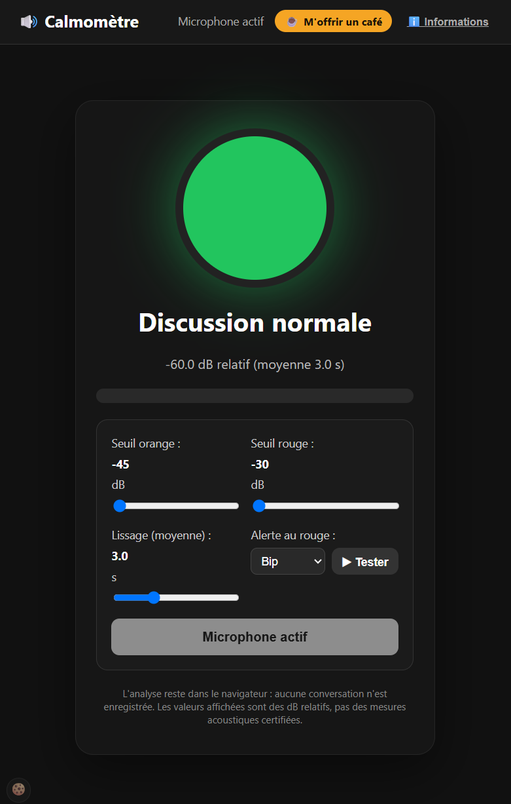
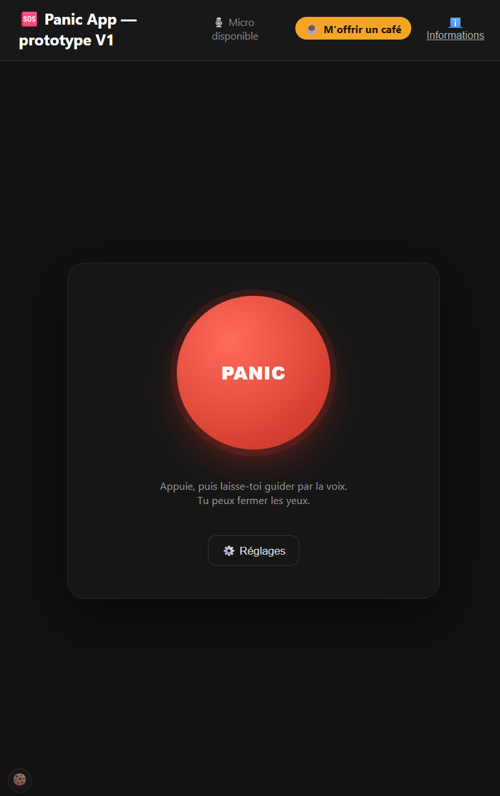
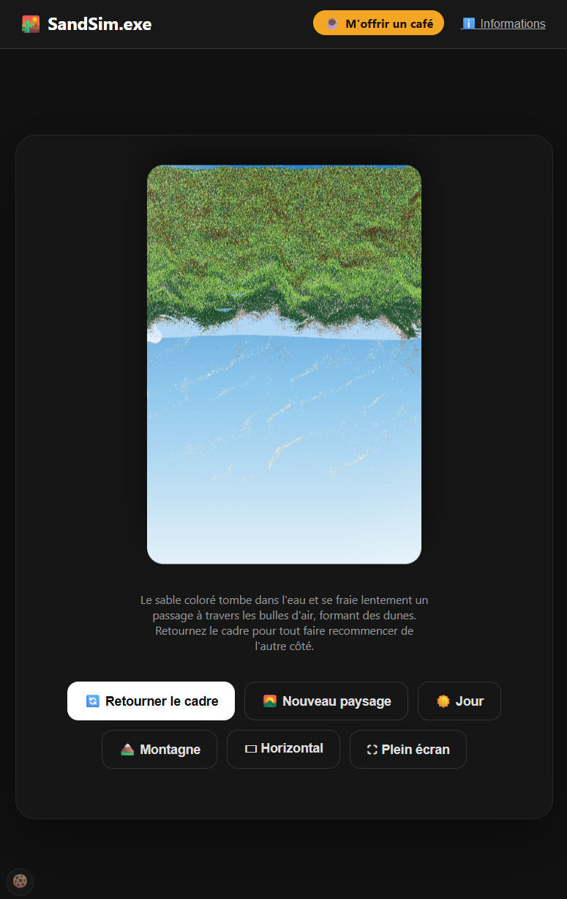
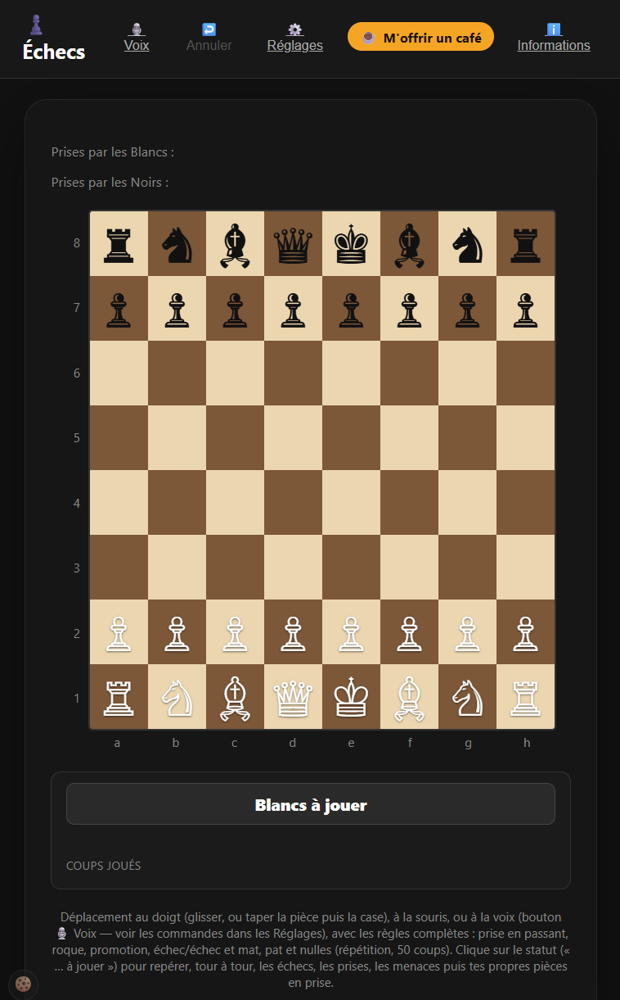

# Bienvenue
Ceci un espace pour partager mes projets.

☕ Ces applis sont gratuites et sans publicité : si elles vous rendent service ou vous amusent, vous pouvez [m'offrir un café sur Ko-fi](https://ko-fi.com/lfranck). Merci !

🍪 Les visites sont comptées avec Google Analytics, uniquement si vous l'acceptez dans le bandeau affiché à la première visite (le bouton 🍪, en bas à gauche, permet de changer d'avis).

ℹ️ Chaque appli a ses propres aides, accessibles depuis les boutons « i » : n'hésitez pas à explorer et à essayer les réglages.

# Liste des projets disponibles

<table>
  <tr>
    <td align="center" valign="top"> <a href="calmometre.html">Calmomètre</a></td>
    <td align="center" valign="top"> <a href="panicapp.html">Panic App</a></td>
    <td align="center" valign="top"> <a href="sable.html">SandSim.exe</a> <a href="sableWebGL.html">version WebGL (expérimentale)</a></td>
    <td align="center" valign="top"> <a href="echecs.html">Échecs</a></td>
  </tr>
</table>

## [Calmomètre](calmometre.html)

*Version 1.4.11*

### But de l'appli

Aider à garder une conversation apaisée : **Calmomètre** écoute le niveau de la voix et prévient dès que le ton commence à monter.

### Fonctionnalités

- Voyant à trois couleurs (vert, orange, rouge) qui suit le niveau sonore en temps réel.
- Alerte au passage au rouge, au choix : bip, courte mélodie ou voix.
- Alerte graduée, qui s'accentue quand les dépassements se rapprochent.
- Seuils, lissage et type d'alerte réglables, mémorisés d'une visite à l'autre.
- Tout se passe dans le navigateur : aucun enregistrement, aucun son envoyé ailleurs.

## [Panic App](panicapp.html)

*Version 0.4.1*

### But de l'appli

Aider à traverser une crise de panique ou de forte anxiété, en détournant l'attention vers des tâches simples plutôt que vers la crise.

### Fonctionnalités

- Un simple bouton PANIC lance une session vocale guidée.
- Une voix pose de courtes questions (calcul, mémoire, observation, logique…) et écoute les réponses au micro.
- La difficulté s'adapte progressivement aux réponses.
- Pensée pour fonctionner sans regarder l'écran.
- Repose sur la synthèse et la reconnaissance vocales du navigateur. Sous Chrome et Edge, la reconnaissance vocale envoie l'audio aux serveurs de Google ou Microsoft pour le transcrire ; la page, elle, ne l'enregistre pas.

## [SandSim.exe](sable.html)

*Version 1.31.75*

### But de l'appli

Reproduire dans le navigateur ces cadres de « sable animé » où des sables colorés tombent lentement dans un liquide pour dessiner des dunes et des paysages — à regarder pour se détendre, hypnotique.

### Fonctionnalités

- Simulation de sables colorés de densités différentes, qui traversent une couche de bulles d'air et s'empilent avec un angle de repos naturel.
- Ciel animé : soleil, nuages, avions, étoiles filantes, et un ovni rigolo qui aspire du sable de temps en temps.
- Modes Jour, Nuit et Auto (la nuit tombe quand le soleil sort du ciel).
- Plusieurs thèmes, chacun avec ses sables et son ciel : Montagne, Désert, Arctique, Océans, Lune… et une mystérieuse planète inconnue.
- Retournement du cadre à 180°, passage du format vertical au format horizontal, plein écran.
- Inclinaison libre du tableau à la souris, au doigt ou en penchant son téléphone : la gravité suit.
- Réglages de la simulation : résolution, bulles, viscosité, gravité, courant tourbillonnant, bords reliés…
- Réglage du nombre de grains, de la proportion et de la densité de chaque couleur.
- Réglages mémorisés d'une visite à l'autre.

### Version WebGL (expérimentale)

[SandSim.exe WebGL](sableWebGL.html) : la même appli, dont l'affichage du sable est calculé par la carte graphique. Elle permet de monter beaucoup plus haut en résolution (jusqu'à 1320 grains sur le petit côté, avec 300 000 grains au plus), en vue d'un futur mode plein écran à la résolution de l'écran. En cours d'optimisation : selon la machine, les très hautes résolutions peuvent encore ralentir.

## [Échecs](echecs.html)

*Version 0.14.18*

### But de l'appli

Suivre un livre de stratégie d'échecs sans échiquier sous la main : on dicte les coups lus dans le livre, et le plateau s'affiche à l'écran. Plus besoin de reconstituer la position de tête, et les mains restent libres pour tenir le livre. Rien n'empêche aussi de jouer une partie au doigt ou à la souris. *(Prototype en cours de développement.)*

### Fonctionnalités

- Pilotage vocal (« e2 e4 », « cavalier f3 », « petit roque », « annule »…), tolérant aux approximations de la transcription. Sous Chrome et Edge, la reconnaissance vocale envoie l'audio aux serveurs de Google ou Microsoft pour le transcrire ; la page, elle, ne l'enregistre pas.
- Règles complètes : prise en passant, roque, promotion, échec, mat, pat et nulles (répétition, 50 coups).
- Notation des coups joués et affichage des pièces capturées.
- Nouvelle partie et annulation de coup.
- Méthode d'entraînement « échecs / prises / menaces / pièces en prise », qui surligne sur le plateau les coups ou pièces concernés.
